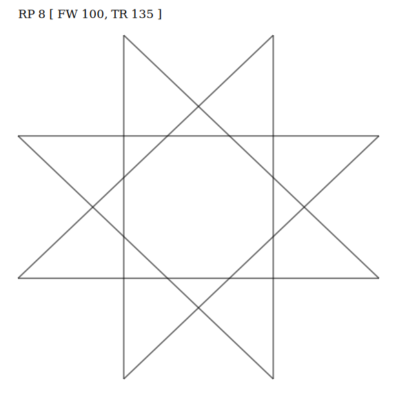
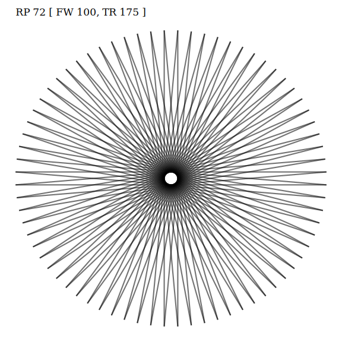
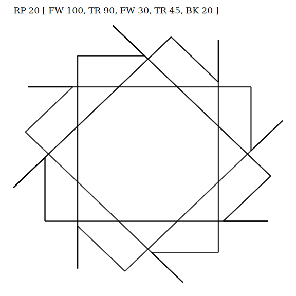
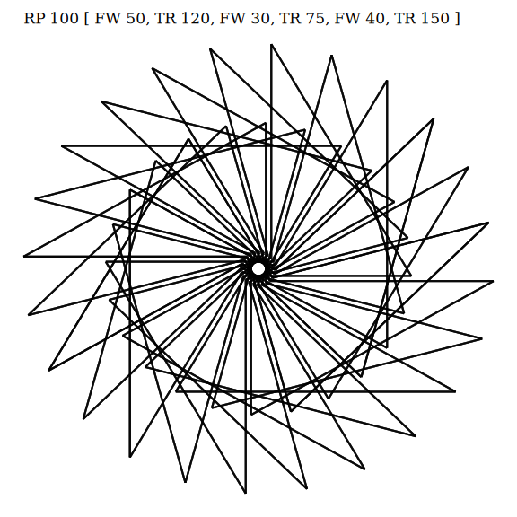

# ggturtle

Use ggplot2 to draw like turtle in LOGO language.

## Installation

```{r}
if (!require(devtools)) install.packages("devtools")
devtools::install_github("yanlinlin82/ggturtle")
```

## Usage Example

```{r}
library(ggturtle)

turtle_init() %>%
  go_forward(100) %>%
  turn_right(120) %>%
  go_forward(100) %>%
  turn_right(120) %>%
  go_forward(100) %>%
  turtle_draw()
```

```{r}
a <- turtle_init()
for (i in 1:8) {
  a <- a %>% go_forward(100) %>% turn_right(135)
}
a %>%
  turtle_draw("RP 8 [ FW 100, TR 135 ]") %>%
  ggsave(filename = "plot-001.png", width = 8, height = 8)
```



```{r}
a <- turtle_init()
for (i in 1:72) {
  a <- a %>% go_forward(100) %>% turn_right(175)
}
a %>%
  turtle_draw("RP 72 [ FW 100, TR 175 ]") %>%
  ggsave(filename = "plot-002.png", width = 8, height = 8)
```



```{r}
a <- turtle_init()
for (i in 1:20) {
  a <- a %>% go_forward(100) %>% turn_right(90) %>% go_forward(30) %>% turn_right(45) %>% go_forward(-20)
}
a %>%
  turtle_draw("RP 20 [ FW 100, TR 90, FW 30, TR 45, BK 20 ]") %>%
  ggsave(filename = "plot-003.png", width = 8, height = 8)
```



```{r}
a <- turtle_init()
for (i in 1:100) {
  a <- a %>% go_forward(50) %>% turn_right(120) %>% go_forward(30) %>% turn_left(75) %>% go_forward(40) %>% turn_right(150)
}
a %>%
  turtle_draw("RP 100 [ FW 50, TR 120, FW 30, TR 75, FW 40, TR 150 ]") %>%
  ggsave(filename = "plot-004.png", width = 8, height = 8)
```


